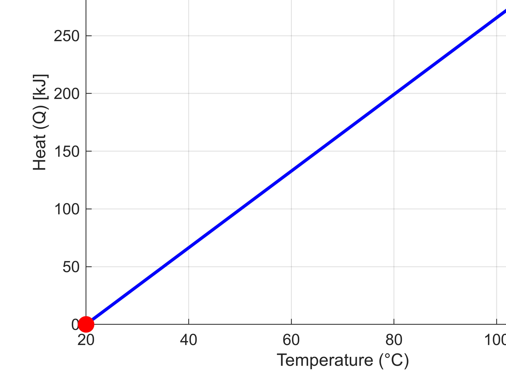
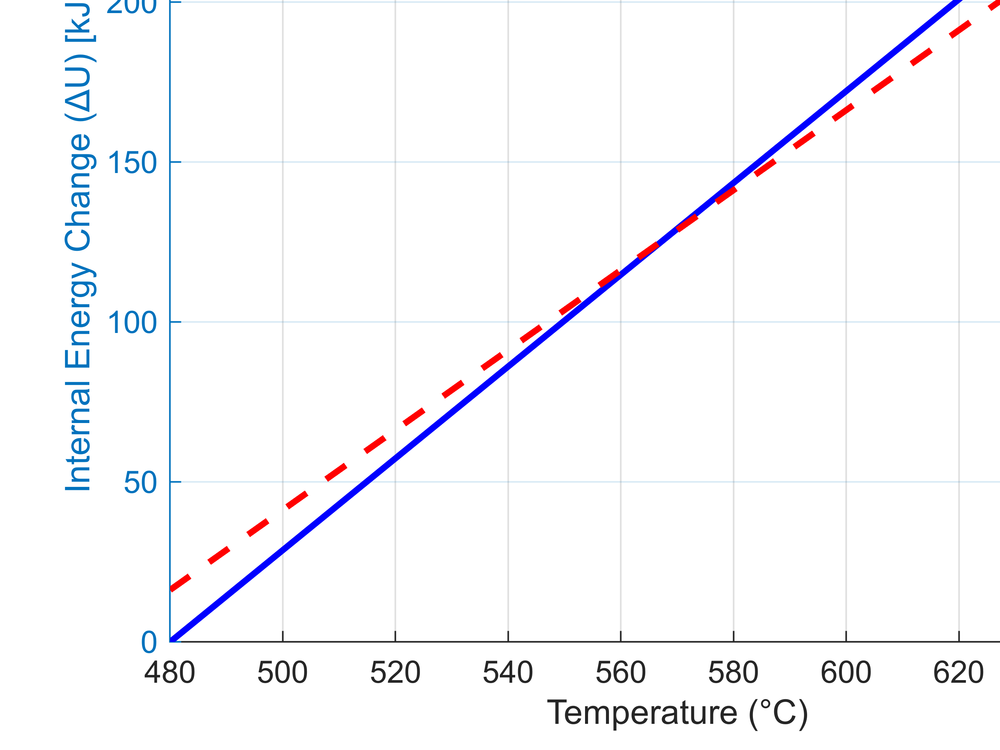

**1. 정적과정이란?**

-  **정적과정**은 부피가 일정하게 유지되는 상태에서 시스템의 압력과 온도가 변화하는 과정입니다. 
-  이는 **등적과정**이라고도 불리며, 이상기체 상태방정식에서  

 $$ .V=\textrm{const.} $$ 

-  로 표시됩니다. 


-  정적과정에서는 다음 관계식이 성립합니다: 

 $$ \frac{P_1 }{T_1 }=\frac{P_2 }{T_2 } $$ 

-  이 식은 압력과 온도가 비례하는 관계를 나타내며, 부피가 일정할 때 온도가 증가하면 압력도 증가하게 됩니다. 

**예시**


최소한의 에너지로 압력변화가 최소화(최대화)


에너지 소비와 압력변화가 모두 온도에 직선적으로 비례하므로, 최적화를 하면 온도 변화가 최소로 설정되면 에너지 변화와 압력변화 모두 최소화가 됩니다.  따라서 온도를 증가시키는 최적화와 감소시키는 최적화가 상대적으로 유사한 결과를 내게 됩니다.

```matlab
% 주어진 정보
V = 1; % 일정한 부피 (m^3)
T1 = 300; % 초기 온도 (K)
P1 = 100; % 초기 압력 (kPa)
R = 0.287; % 공기의 기체 상수 (kJ/kgK)
cV = 0.72; % 정적 비열 (kJ/kgK)
m = 1; % 공기의 질량 (kg)

% 최적화 목적: 최소한의 에너지로 압력 최대화
% 압력 변화: P = mRT / V
% 에너지: Q = m c_V (T2 - T1)

% 목적 함수: 압력을 최대화하는 동시에 에너지를 최소화하는 함수
objective = @(T2) -(m * R * T2 / V) + (m * cV * (T2 - T1)); % 압력 최대화 & 에너지 최소화
Tmin = 300; % 최소 온도 제약 (K)
Tmax = 600; % 최대 온도 제약 (K)

% 최적화 문제 해결
optimal_T = fminbnd(objective, Tmin, Tmax); % 온도 범위 내에서 최적 온도 찾기
optimal_P = (m * R * optimal_T) / V; % 최적 온도에서 압력 계산
optimal_energy = m * cV * (optimal_T - T1); % 최적 온도에서 에너지 계산

% 결과 출력
fprintf('최적 온도: %.2f K\n', optimal_T);
```

```matlabTextOutput
최적 온도: 300.00 K
```

```matlab
fprintf('최적 압력: %.2f kPa\n', optimal_P);
```

```matlabTextOutput
최적 압력: 86.10 kPa
```

```matlab
fprintf('최적 에너지: %.2f kJ\n', optimal_energy);
```

```matlabTextOutput
최적 에너지: 0.00 kJ
```

```matlab

% --- 2D P-V 다이어그램 시각화 ---
T_range = linspace(T1, optimal_T, 100); % 온도 범위
P_range = (m * R * T_range) / V; % 해당 온도에서의 압력 계산

figure;
plot(T_range, P_range, 'b-', 'LineWidth', 2); % 압력 변화
hold on;
plot([T1 optimal_T], [P1 optimal_P], 'ro', 'MarkerSize', 10, 'MarkerFaceColor', 'r'); % 초기, 최종 상태 표시
xlabel('Temperature (T) [K]');
ylabel('Pressure (P) [kPa]');
title('Isometric Process P-T Diagram with Maximum Pressure Optimization');
grid on;
hold off;
```


```matlab

% --- 3차원 P-V-T 시각화 ---
[T_grid, P_grid] = meshgrid(T_range, P_range); % 온도와 압력 격자 생성
V_grid = V * ones(size(T_grid)); % 부피는 일정하므로 부피 격자 생성

figure;
surf(V_grid, T_grid, P_grid, 'EdgeColor', 'none'); % 3D 표면 그래프 그리기
colorbar; % 색상 표시
xlabel('Volume (V) [m^3]');
ylabel('Temperature (T) [K]');
zlabel('Pressure (P) [kPa]');
title('3D Visualization of Isochoric Process (P-V-T)');
grid on;
view(3); % 3차원 뷰로 설정

% 최적화된 값 표시
hold on;
plot3(V, optimal_T, optimal_P, 'ro', 'MarkerSize', 10, 'MarkerFaceColor', 'r'); % 최적 부피와 온도 표시
text(V, optimal_T, optimal_P, sprintf('Optimal T=%.2fK, P=%.2f kPa', optimal_T, optimal_P), 'VerticalAlignment', 'bottom');
hold off;
```


**2. 정적과정의 관계식절대일 (Work)**

-  정적과정에서 부피의 변화가 없기 때문에:  

 $$ \delta V=0 $$ 

-  따라서, 계에서 외부로 수행되는 일 $W$ 은 다음과 같이 계산됩니다:  

 $$ \delta W=PdV=0 $$ 

-  즉, **정적과정에서는 계가 외부에 일을 하지 않는다**는 결론을 얻을 수 있습니다:  

 $$ W=0 $$ 

**3. 공업일 (Work)**

-  정적과정에서 계의 부피가 변하지 않기 때문에 외부에 대한 일은 항상 **0**입니다.  

 $$ W_t =-\int_1^2 V\mathrm{dP}=-V\left(P_2 -P_1 \right)=\mathrm{mR}\left(T_1 -T_2 \right) $$ 

-  따라서, 압력 변화에 상관없이 부피가 일정하므로 계가 외부에 일을 할 수 없습니다. 

**4. 내부 에너지 변화**

-  내부 에너지 변화는 온도 변화에 의해서만 발생하며, 열역학 제1법칙에 따라: 

 $$ dU=mc_V dT $$ 

-  여기서 $c_V$ 는 정적 비열입니다. 

-  상태 변화에 따른 내부 에너지의 변화량 $\Delta U$ 는 다음과 같이 주어집니다: 

 $$ \Delta U=U_2 -U_1 =mc_V (T_2 -T_1 ) $$ 

-  이 과정에서 전달된 열은 내부 에너지의 변화로 전환됩니다: 

 $$ Q=\Delta U=mc_V (T_2 -T_1 ) $$ 

-  정적과정에서는 외부에 일을 하지 않기 때문에, 계에 가해진 모든 열은 내부 에너지의 변화로만 작용하게 됩니다. 


```matlab
% MATLAB Code for Isochoric Process (P-V Diagram)

% 초기 조건 설정
V = 1; % 정적과정에서 부피는 일정
P1 = 100; % 초기 압력 (예: 100 kPa)
P2 = 150; % 최종 압력 (예: 150 kPa)
T1 = 300; % 초기 온도 (K)
T2 = 400; % 최종 온도 (K)

% 그래프 그리기
figure;
hold on;

% T1에서의 등온선 (부피 변화하는 일반적인 이상 기체 등온선 형태)
V_range = linspace(0.5, 2, 100); % 부피 범위 설정
P_T1 = P1 * (T1 ./ V_range); % 이상 기체 법칙을 이용해 P-V 곡선 생성
plot(V_range, P_T1, 'r', 'LineWidth', 2); % T1에서의 등온선 그리기

% T2에서의 등온선
P_T2 = P2 * (T2 ./ V_range); % T2에서의 P-V 곡선 생성
plot(V_range, P_T2, 'b', 'LineWidth', 2); % T2에서의 등온선 그리기

% 정적과정: 부피가 일정할 때 압력 변화
plot([V V], [P1 P2], 'k--', 'LineWidth', 2); % 정적과정은 수직선

% 축 라벨 및 제목 설정
xlabel('Volume (V)');
ylabel('Pressure (P)');
title('P-V Diagram for Isochoric Process');
legend('T1 isotherm', 'T2 isotherm', 'Isochoric Process', 'Location', 'northeast');

% 그리기 옵션
grid on;
hold off;
```


**1. 주어진 정보**

-  용기의 부피: $500\times 10^{-3} \,m^3$ 
-  초기 압력: $P_1 =420\,kPa$ 
-  초기 온도: $T_1 =110^{\circ } C=110+273=383\,K$ 
-  방출된 열량: $Q=-80\,kJ$ 
-  기체 상수: $R=0.303\,kJ/kgK$ 
-  정적 비열: $c_V =0.772\,kJ/kgK$ 

**2. 질량 계산**


이상기체 상태방정식을 사용하여 기체의 질량을 계산할 수 있습니다:

 $$ PV=mRT $$ 

여기서, $P_1$ ​, $V$ , $R$ , $T_1$ ​을 대입하면:

 $$ m=\frac{P_1 V_1 }{RT_1 }=\frac{420\times 500\times 10^{-3} }{0.303\times 383}\approx 1.81\,kg $$ 

**3. 정적과정에서의 열역학적 관계**


정적과정에서의 열역학 제1법칙에 의해, 계에 전달된 열 $Q$ 는 내부 에너지의 변화로만 작용합니다. 내부 에너지 변화는 다음과 같은 관계로 표현됩니다:

 $$ Q=\Delta U=mc_V (T_2 -T_1 ) $$ 

이를 이용해 새로운 온도 $T_2$ 를 계산하기 위해서는, 다음 식을 통해 압력 $P_2$ 와 연결할 수 있습니다:

 $$ Q=mc_V T_1 \left(\frac{T_2 }{T_1 }-1\right)=mc_V T_1 \left(\frac{P_2 }{P_1 }-1\right) $$ 

**4. 열역학 관계 대입 및 계산**


주어진 열 $Q=-80\,kJ$ , 그리고 질량 $m=1.81\,kg$ , 정적 비열 $c_V =0.772\,kJ/kgK$ , 초기 온도 $T_1 =383\,K$ 을 대입하면:

 $$ -80=1.81\times 0.772\times 383\left(\frac{P_2 }{420}-1\right) $$ 

 **5.** $P_2$ **​** **값 정리** 


위 식을 정리하면:

 $$ P_2 =357.22\,kPa $$ 
```matlab
% 주어진 정보
V = 500e-3; % 부피 (m^3)
P1 = 420; % 초기 압력 (kPa)
T1 = 110 + 273; % 초기 온도 (K)
Q = -80; % 방출된 열량 (kJ)
R = 0.303; % 기체 상수 (kJ/kgK)
cV = 0.722; % 정적 비열 (kJ/kgK)

% 이상기체 상태방정식으로 질량 계산
m = (P1 * V) / (R * T1); % kg

% 최종 온도 계산
T2 = T1 + Q / (m * cV); % K

% 최종 압력 계산 (이상기체 상태방정식 이용)
P2 = (m * R * T2) / V; % kPa

% 결과 출력
fprintf('첫 번째 문제 결과:\n');
```

```matlabTextOutput
첫 번째 문제 결과:
```

```matlab
fprintf('최종 온도 T2 = %.2f K\n', T2);
```

```matlabTextOutput
최종 온도 T2 = 321.77 K
```

```matlab
fprintf('최종 압력 P2 = %.2f kPa\n', P2);
```

```matlabTextOutput
최종 압력 P2 = 352.85 kPa
```

```matlab

% 시각화: P-T 다이어그램
T_range = linspace(T1, T2, 100); % 온도 범위
P_range = (m * R * T_range) / V; % 이상기체 방정식 이용한 압력 범위

figure;
plot(T_range, P_range, 'b-', 'LineWidth', 2);
hold on;
plot(T1, P1, 'ro', 'MarkerSize', 10, 'MarkerFaceColor', 'r');
plot(T2, P2, 'go', 'MarkerSize', 10, 'MarkerFaceColor', 'g');
xlabel('Temperature (K)');
ylabel('Pressure (kPa)');
title('P-T Diagram for Isochoric Process (First Problem)');
legend('P-T Relationship', 'Initial State', 'Final State');
grid on;
hold off;
```


**1. 주어진 정보**

-  압력: $P_1 =110\,kPa$ 
-  온도: $T_1 =20^{\circ } C=20+273=293\,K$ 
-  용기의 부피: $V_1 =0.6\,m^3$ 
-  최종 온도: $T_2 =125^{\circ } C=125+273=398\,K$ 
-  정적 비열: $c_V =0.722\,kJ/kgK$ 
-  기체 상수: $R=0.287\,kJ/kgK$ 

**2. 상태 방정식을 이용한 질량 계산**


이상기체 상태방정식을 통해 공기의 질량 $m$ 을 계산할 수 있습니다:

 $$ PV=mRT $$ 

여기서 $P_1 ,V_1 ,R,T_1$ ​ 값을 대입하여 공기의 질량을 계산하면:

 $$ m=\frac{P_1 V_1 }{RT_1 }=\frac{110\times 0.6}{0.287\times 293}\approx 0.784\,kg $$ 

**3. 내부 에너지 변화 계산**


정적과정에서는 내부 에너지 변화가 온도 변화에 의해 발생하므로 다음 식을 사용합니다:

 $$ Q=\Delta U=mc_V (T_2 -T_1 ) $$ 

위에서 구한 $m$ 값과 주어진 정보를 대입하면:

 $$ Q=0.784\times 0.722\times (398-293) $$ 

 $$ Q\approx 59.5\,kJ $$ 
```matlab
% 주어진 정보
P1 = 110; % 초기 압력 (kPa)
T1 = 20 + 273; % 초기 온도 (K)
V = 0.6; % 부피 (m^3)
T2 = 125 + 273; % 최종 온도 (K)
R = 0.287; % 기체 상수 (kJ/kgK)
cV = 0.722; % 정적 비열 (kJ/kgK)

% 이상기체 상태방정식으로 질량 계산
m = (P1 * V) / (R * T1); % kg

% 내부 에너지 변화 계산
Q = m * cV * (T2 - T1); % kJ

% 최종 압력 계산
P2 = (m * R * T2) / V; % kPa

% 결과 출력
fprintf('두 번째 문제 결과:\n');
```

```matlabTextOutput
두 번째 문제 결과:
```

```matlab
fprintf('내부 에너지 변화 Q = %.2f kJ\n', Q);
```

```matlabTextOutput
내부 에너지 변화 Q = 59.50 kJ
```

```matlab
fprintf('최종 압력 P2 = %.2f kPa\n', P2);
```

```matlabTextOutput
최종 압력 P2 = 149.42 kPa
```

```matlab

% 시각화: P-T 다이어그램
T_range = linspace(T1, T2, 100); % 온도 범위
P_range = (m * R * T_range) / V; % 이상기체 방정식 이용한 압력 범위

figure;
plot(T_range, P_range, 'r-', 'LineWidth', 2);
hold on;
plot(T1, P1, 'ro', 'MarkerSize', 10, 'MarkerFaceColor', 'r');
plot(T2, P2, 'go', 'MarkerSize', 10, 'MarkerFaceColor', 'g');
xlabel('Temperature (K)');
ylabel('Pressure (kPa)');
title('P-T Diagram for Isochoric Process (Second Problem)');
legend('P-T Relationship', 'Initial State', 'Final State');
grid on;
hold off;
```


**1. 정압과정이란?**

-  **정압과정**은 압력이 일정하게 유지되면서 상태가 변하는 과정을 의미합니다. 
-  이상기체 상태방정식에서, 압력이 일정하므로:  

 $$ \frac{V_1 }{T_1 }=\frac{V_2 }{T_2 }=C $$ 

-  여기서 $V_1$ 와 $V_2$ ​는 각각 초기와 최종 부피, $T_1$ 과 $T_2$ 는 각각 초기와 최종 온도를 나타냅니다. 

**2. 정압과정의 관계식**


**(1). 상태 ①에서 ②로 압력이 일정하게 유지되면서 부피와 온도가 변화합니다.**


 **(2). 계는 열을 받아서** **일을 수행****합니다. 정압과정에서 수행되는 일은:**

 $$ W=P(V_2 -V_1 ) $$ 

즉, 부피가 증가할 때 일정한 압력에서 외부에 대해 일을 하게 됩니다.


**(3). 이 과정에서 내부 에너지 변화가 발생합니다:**

 $$ \Delta U=mc_P (T_2 -T_1 ) $$ 

여기서 $c_P$ ​는 정압 비열입니다.


 **3. 그래프** 


-  $P-V$ 다이어그램에서, 압력은 일정하고 부피가 증가하면서 온도가 증가합니다. 
-  부피의 변화에 따라 계가 외부에 대해 일을 수행하게 됩니다. 그래프에서 직사각형의 면적이 수행된 일을 나타냅니다. 

**예시**


정압과정에서 부피가 커지면, 시스템이 외부에 일을 하게 되어 추가적인 에너지 소비가 발생합니다. 반대로 부피가 줄어들면 외부에 하는 일이 적어져 에너지 소비가 줄어듭니다. 이 때문에 **최대화와 최소화 최적화에서 서로 다른 결과**가 나타나게 됩니다.


1. 최소 에너지로 최대 부피 증가에 대한 최적화

```matlab
% 주어진 정보
P = 100; % 일정한 압력 (kPa)
T1 = 300; % 초기 온도 (K)
T2 = 500; % 최종 온도 (K)
R = 0.287; % 공기의 기체 상수 (kJ/kgK)
m = 1; % 공기의 질량 (kg)

% 초기와 최종 부피 계산 (V = mRT / P)
V1 = (m * R * T1) / P; % 초기 부피
V2 = (m * R * T2) / P; % 최종 부피

% 최적화 목적: 최소 에너지 사용으로 최대 부피 증가
% 목적함수: 부피 변화 최대화
objective = @(T) -((m * R * T) / P); % 부피를 최대화하는 것이 목적이므로 -부피 사용
Tmin = 300; % 최소 온도 제약 (K)
Tmax = 600; % 최대 온도 제약 (K)

% 최적화 문제 해결
optimal_T = fminbnd(objective, Tmin, Tmax); % 온도 범위 내에서 최적 온도 찾기
optimal_V = (m * R * optimal_T) / P; % 최적 온도에서 부피 계산

% 결과 출력
fprintf('최적 온도: %.2f K\n', optimal_T);
```

```matlabTextOutput
최적 온도: 600.00 K
```

```matlab
fprintf('최적 부피: %.2f m^3\n', optimal_V);
```

```matlabTextOutput
최적 부피: 1.72 m^3
```

```matlab

% --- 2D P-V 다이어그램 시각화 ---
T_range = linspace(T1, T2, 100); % 온도 범위
V_range = (m * R * T_range) / P; % 해당 온도에서의 부피 계산

figure;
plot(V_range, P * ones(size(V_range)), 'b-', 'LineWidth', 2); % 압력 일정, 부피 변화
hold on;
plot([V1 V2], [P P], 'ro', 'MarkerSize', 10, 'MarkerFaceColor', 'r'); % 초기, 최종 상태 표시
xlabel('Volume (V) [m^3]');
ylabel('Pressure (P) [kPa]');
title('Isobaric Process P-V Diagram with Optimization');
grid on;
hold off;
```


```matlab

% --- 3차원 P-V-T 시각화 ---
[T_grid, P_grid] = meshgrid(T_range, linspace(P, P, 100)); % 온도와 압력 격자 생성 (압력은 일정)
V_grid = (m * R * T_grid) ./ P_grid; % 각 온도와 압력에 따른 부피 계산

figure;
surf(V_grid, T_grid, P_grid, 'EdgeColor', 'none'); % 3D 표면 그래프 그리기
colorbar; % 색상 표시
xlabel('Volume (V) [m^3]');
ylabel('Temperature (T) [K]');
zlabel('Pressure (P) [kPa]');
title('3D Visualization of Isobaric Process (P-V-T)');
grid on;
view(3); % 3차원 뷰로 설정

% 최적화된 값 표시
hold on;
plot3(optimal_V, optimal_T, P, 'ro', 'MarkerSize', 10, 'MarkerFaceColor', 'r'); % 최적 부피와 온도 표시
text(optimal_V, optimal_T, P, sprintf('Optimal T=%.2fK, V=%.2f m^3', optimal_T, optimal_V), 'VerticalAlignment', 'bottom');
hold off;
```


2. 최소 에너지로 최소 부피 증가에 대한 최적화 

```matlab
% 주어진 정보
P = 100; % 일정한 압력 (kPa)
T1 = 300; % 초기 온도 (K)
T2 = 500; % 최종 온도 (K)
R = 0.287; % 공기의 기체 상수 (kJ/kgK)
m = 1; % 공기의 질량 (kg)
cP = 1.005; % 정압 비열 (kJ/kgK)

% 초기와 최종 부피 계산 (V = mRT / P)
V1 = (m * R * T1) / P; % 초기 부피
V2 = (m * R * T2) / P; % 최종 부피

% 최적화 목적: 최소 에너지로 최소 부피 증가
% 목적함수: 에너지 사용을 최소화하면서 부피 증가도 최소화
objective = @(T) (m * cP * (T - T1)) + abs((m * R * T) / P - V1); 
% 에너지와 부피 변화가 모두 최소화되도록 설정
Tmin = 300; % 최소 온도 제약 (K)
Tmax = 600; % 최대 온도 제약 (K)

% 최적화 문제 해결
optimal_T = fminbnd(objective, Tmin, Tmax); % 온도 범위 내에서 최적 온도 찾기
optimal_V = (m * R * optimal_T) / P; % 최적 온도에서 부피 계산
optimal_energy = m * cP * (optimal_T - T1); % 최적 온도에서 에너지 계산

% 결과 출력
fprintf('최적 온도: %.2f K\n', optimal_T);
```

```matlabTextOutput
최적 온도: 300.00 K
```

```matlab
fprintf('최적 부피: %.2f m^3\n', optimal_V);
```

```matlabTextOutput
최적 부피: 0.86 m^3
```

```matlab
fprintf('최적 에너지: %.2f kJ\n', optimal_energy);
```

```matlabTextOutput
최적 에너지: 0.00 kJ
```

```matlab

% --- 2D P-V 다이어그램 시각화 ---
T_range = linspace(T1, T2, 100); % 온도 범위
V_range = (m * R * T_range) / P; % 해당 온도에서의 부피 계산

figure;
plot(V_range, P * ones(size(V_range)), 'b-', 'LineWidth', 2); % 압력 일정, 부피 변화
hold on;
plot([V1 V2], [P P], 'ro', 'MarkerSize', 10, 'MarkerFaceColor', 'r'); % 초기, 최종 상태 표시
xlabel('Volume (V) [m^3]');
ylabel('Pressure (P) [kPa]');
title('Isobaric Process P-V Diagram with Minimum Energy Optimization');
grid on;
hold off;
```


```matlab

% --- 3차원 P-V-T 시각화 ---
[T_grid, P_grid] = meshgrid(T_range, linspace(P, P, 100)); % 온도와 압력 격자 생성 (압력은 일정)
V_grid = (m * R * T_grid) ./ P_grid; % 각 온도와 압력에 따른 부피 계산

figure;
surf(V_grid, T_grid, P_grid, 'EdgeColor', 'none'); % 3D 표면 그래프 그리기
colorbar; % 색상 표시
xlabel('Volume (V) [m^3]');
ylabel('Temperature (T) [K]');
zlabel('Pressure (P) [kPa]');
title('3D Visualization of Isobaric Process (P-V-T)');
grid on;
view(3); % 3차원 뷰로 설정

% 최적화된 값 표시
hold on;
plot3(optimal_V, optimal_T, P, 'ro', 'MarkerSize', 10, 'MarkerFaceColor', 'r'); % 최적 부피와 온도 표시
text(optimal_V, optimal_T, P, sprintf('Optimal T=%.2fK, V=%.2f m^3', optimal_T, optimal_V), 'VerticalAlignment', 'bottom');
hold off;
```


**4. 절대일 (Work)**


정압과정에서의 일은 다음과 같은 식으로 계산됩니다:

 $$ W=\int_{V_1 }^{V_2 } P\,dV=P(V_2 -V_1 ) $$ 

이 식은 부피 변화가 있을 때 일정한 압력 하에서 외부에 대해 계가 수행하는 일을 나타냅니다. 또한, 이를 이상기체 상태방정식을 이용해 다음과 같이 표현할 수 있습니다:

 $$ W=mR(T_2 -T_1 ) $$ 

즉, 온도 차이에 따른 일의 양을 구할 수 있습니다.


**5. 공업일 (Technical Work)**


공업일은 다음과 같은 식으로 계산됩니다:

 $$ W_t =-\int_{P_1 }^{P_2 } V\,dP=0 $$ 

정압과정에서는 압력이 일정하므로, 압력 변화 $dP=0$ 로 인해 공업일은 0이 됩니다.


따라서, 정압과정에서는 압력 변화가 없으므로 외부로 한 공업일은 없습니다.


**6. 내부 에너지 변화**


정압과정에서 내부 에너지 변화는 다음과 같이 계산됩니다:

 $$ \Delta U=mc_V (T_2 -T_1 ) $$ 

여기서 $c_V$ 는 정적 비열이며, 온도의 차이에 의해 내부 에너지가 변화합니다.


내부 에너지의 구체적인 변화량은 다음과 같이 표현할 수 있습니다:

 $$ U_2 -U_1 =m\frac{R}{k-1}(T_2 -T_1 ) $$ 

이때 $k$ 는 비열비 $\frac{c_P }{c_V }$ 입니다.


추가적으로, 압력과 부피를 통해서도 표현할 수 있습니다:


 $U_2 -U_1 =\frac{P_2 V_2 -P_1 V_1 }{k-1}$ ​​


이는 부피와 압력 변화가 내부 에너지에 미치는 영향을 설명합니다.


**7. 계로 전달된 열량**


계로 전달된 열량은 내부 에너지 변화와 외부에 수행된 일을 더한 값으로 나타납니다:

 $$ Q=\Delta U+W $$ 

 $$ Q=(U_2 -U_1 )+(P_2 V_2 -P_1 V_1 ) $$ 

또는:

 $$ Q=mc_P (T_2 -T_1 ) $$ 

여기서 $c_P$ 는 정압 비열입니다.


**8. 정압과정의 특징**

-  정압과정에서는 계에 출입하는 열량이 엔탈피의 변화량과 같다는 점이 중요합니다. 
-  따라서, 엔탈피 변화량 $\Delta H$ 는 다음과 같이 계산됩니다: 

 $$ \Delta H=H_2 -H_1 =mc_P (T_2 -T_1 ) $$ 

**문제1**


**1. 내부 에너지 변화 (** $\Delta U$ **)**


정압과정에서 내부 에너지 변화는 **정적 비열** $c_V$ ​를 이용하여 다음과 같이 계산됩니다:

 $$ \Delta U=mc_V (T_2 -T_1 ) $$ 

여기서:

-  $m$ 은 공기의 질량 (kg) 
-  $c_V$ ​는 정적 비열 (kJ/kgK) 
-  $T_2$ ​는 최종 온도 (K) 
-  $T_1$ 은 초기 온도 (K) 

 $$ \Delta U=0.4\times 0.72\times (403-298)=30.24\,\textrm{kJ} $$ 

**2. 가해진 열량 (** $Q$ **)**


정압과정에서 가해진 열량은 **정압 비열** $c_P$ ​를 이용하여 다음과 같이 계산됩니다:

 $$ Q=mc_P (T_2 -T_1 ) $$ 

여기서:

-  $c_P$ ​는 정압 비열 (kJ/kgK) 

 $$ Q=0.4\times 1.0\times (403-298)=42\,\textrm{kJ} $$ 

**3. 기계가 한 일 (** $W$ **)**


기계가 한 일은 가해진 열량과 내부 에너지 변화의 차이로 계산됩니다:

 $$ W=Q-\Delta U $$ 

 $$ W=42-30.24=11.76\,\textrm{kJ} $$ 

```matlab
% 주어진 정보
m = 0.4; % 공기의 질량 (kg)
T1 = 25 + 273; % 초기 온도 (K)
T2 = 130 + 273; % 최종 온도 (K)
cV = 0.72; % 정적 비열 (kJ/kgK)
cP = 1.0; % 정압 비열 (kJ/kgK)
P = 300; % 압력 (kPa)

% 1. 내부 에너지 변화 계산
delta_U = m * cV * (T2 - T1); % 내부 에너지 변화 (kJ)
fprintf('1) 내부 에너지 변화: %.2f kJ\n', delta_U);
```

```matlabTextOutput
1) 내부 에너지 변화: 30.24 kJ
```

```matlab

% 2. 가해진 열량 계산
Q = m * cP * (T2 - T1); % 가해진 열량 (kJ)
fprintf('2) 가해진 열량: %.2f kJ\n', Q);
```

```matlabTextOutput
2) 가해진 열량: 42.00 kJ
```

```matlab

% 3. 기계가 한 일 계산 (일은 열량과 내부 에너지 변화 차이)
W = Q - delta_U; % 기계가 한 일 (kJ)
fprintf('3) 기계가 한 일: %.2f kJ\n', W);
```

```matlabTextOutput
3) 기계가 한 일: 11.76 kJ
```

```matlab

% 시각화: P-V 다이어그램 그리기
V1 = (m * cP * T1) / P; % 초기 부피 (m^3)
V2 = (m * cP * T2) / P; % 최종 부피 (m^3)

% P-V 다이어그램
figure;
hold on;
plot([V1, V2], [P, P], 'r-', 'LineWidth', 2); % 압력이 일정하므로 수평선
plot(V1, P, 'bo', 'MarkerSize', 10, 'MarkerFaceColor', 'b'); % 초기 상태
plot(V2, P, 'go', 'MarkerSize', 10, 'MarkerFaceColor', 'g'); % 최종 상태

% 그래프 꾸미기
xlabel('Volume (V) [m^3]');
ylabel('Pressure (P) [kPa]');
title('Isobaric Process P-V Diagram');
legend('Isobaric Process', 'Initial State', 'Final State');
grid on;
hold off;
```


**문제2**

-  주어진 엔탈피의 함수: $H=3.32T$ 
-  초기 온도: $T_1 =20^{\circ } C=293\,\textrm{K}$ 
-  최종 온도: $T_2 =116^{\circ } C=389\,\textrm{K}$ 
-  정압과정에서 열량 $Q$ 를 구하는 공식: 

 $$ Q=\Delta H=3.32\Delta T=3.32(T_2 -T_1 ) $$ 

**1. 수식 풀이**


정압과정에서는 엔탈피 변화가 주어지면, 그 변화에 필요한 열량은 다음과 같이 계산할 수 있습니다:

 $$ Q=3.32(T_2 -T_1 ) $$ 

 $$ Q=3.32\times (389-293) $$ 

 $$ Q=3.32\times 96=318.72\,\textrm{kJ} $$ 

따라서, 이 과정에서 필요한 열량은 약 $318.7kJ$ 입니다.

```matlab
% 주어진 정보
T1 = 20 + 273; % 초기 온도 (K)
T2 = 116 + 273; % 최종 온도 (K)
H_coeff = 3.32; % 엔탈피 계수 (kJ/K)

% 열량 계산
Q = H_coeff * (T2 - T1); % 가해진 열량 (kJ)

% 결과 출력
fprintf('가열에 필요한 열량: %.2f kJ\n', Q);
```

```matlabTextOutput
가열에 필요한 열량: 318.72 kJ
```

```matlab

% 시각화 (온도-열량 그래프)
T_range = linspace(T1, T2, 100); % 온도 범위
Q_range = H_coeff * (T_range - T1); % 해당 온도에서 열량 계산

figure;
plot(T_range - 273, Q_range, 'b-', 'LineWidth', 2);
hold on;
plot(T1 - 273, 0, 'ro', 'MarkerSize', 10, 'MarkerFaceColor', 'r'); % 초기점
plot(T2 - 273, Q, 'go', 'MarkerSize', 10, 'MarkerFaceColor', 'g'); % 최종점
xlabel('Temperature (°C)');
ylabel('Heat (Q) [kJ]');
title('Heat Required for Isobaric Process');
legend('Q vs T', 'Initial State', 'Final State');
grid on;
hold off;
```



**문제3**


**주어진 정보:**

-  압력: $P=350\,\textrm{kPa}$ 
-  초기 온도: $T_1 =480^{\circ } C=480+273=753\,\textrm{K}$ 
-  최종 온도: $T_2 =650^{\circ } C=650+273=923\,\textrm{K}$ 
-  공기의 질량: $m=2\,\textrm{kg}$ 
-  공기의 기체 상수: $R=0.287\,\textrm{kJ/kgK}$ 
-  비열비: $k=1.4$ 
-  내부 에너지 변화: $\Delta U=290\,\textrm{kJ}$ 

**풀이 과정**

1.  **내부 에너지 변화 공식**: 정압과정에서 내부 에너지 변화는 정적 비열을 사용하여 다음과 같이 계산됩니다:

 $$ \Delta U=mc_V (T_2 -T_1 ) $$ 

-  여기서  

 $$ c_V =\frac{R}{k-1} $$ 

-  ​이므로:   

  $$ \Delta U=m\times \frac{R}{k-1}\times (T_2 -T_1 ) $$ 

1.  **내부 에너지 변화 계산**:

 $$ \Delta U=2\times \frac{0.287}{1.4-1}\times (923-753) $$ 

 $$ \Delta U=2\times \frac{0.287}{0.4}\times 170=2\times 0.7175\times 170=243.95\,\textrm{kJ} $$ 

1.  **초기 내부 에너지 계산**:

주어진 최종 내부 에너지가 $290\,\textrm{kJ}$ 일 때, 초기 내부 에너지는 다음과 같이 계산됩니다:

 $$ U_1 =U_2 -\Delta U $$ 

 $$ U_1 =290-243.95=46.05\,\textrm{kJ} $$ 

따라서, 공기의 초기 내부 에너지는 **46.05 kJ**입니다.

```matlab
% 주어진 정보
m = 2; % 공기의 질량 (kg)
R = 0.287; % 공기의 기체 상수 (kJ/kgK)
k = 1.4; % 비열비
T1 = 480 + 273; % 초기 온도 (K)
T2 = 650 + 273; % 최종 온도 (K)
U2 = 290; % 최종 내부 에너지 (kJ)

% 내부 에너지 변화 계산
cV = R / (k - 1); % 정적 비열 계산
delta_U = m * cV * (T2 - T1); % 내부 에너지 변화 (kJ)

% 초기 내부 에너지 계산
U1 = U2 - delta_U;

% 결과 출력
fprintf('1) 내부 에너지 변화: %.2f kJ\n', delta_U);
```

```matlabTextOutput
1) 내부 에너지 변화: 243.95 kJ
```

```matlab
fprintf('2) 초기 내부 에너지: %.2f kJ\n', U1);
```

```matlabTextOutput
2) 초기 내부 에너지: 46.05 kJ
```

```matlab

% --- 시각화 ---
% 1. 온도 변화에 따른 내부 에너지 변화
T_range = linspace(T1, T2, 100); % 온도 범위
delta_U_range = m * cV * (T_range - T1); % 각 온도에서의 내부 에너지 변화

figure;
plot(T_range - 273, delta_U_range, 'b-', 'LineWidth', 2);
hold on;
plot(T1 - 273, 0, 'ro', 'MarkerSize', 10, 'MarkerFaceColor', 'r'); % 초기점
plot(T2 - 273, delta_U, 'go', 'MarkerSize', 10, 'MarkerFaceColor', 'g'); % 최종점
xlabel('Temperature (°C)');
ylabel('Internal Energy Change (ΔU) [kJ]');
title('Temperature vs Internal Energy Change');
legend('ΔU vs T', 'Initial State', 'Final State');
grid on;
hold off;
```


```matlab

% 2. 내부 에너지 변화 vs 시간 (가정: 온도가 선형적으로 변화한다고 가정)
time = linspace(0, 10, 100); % 시간 범위 (가정: 10초 동안 변화)
delta_U_time = delta_U * (time / max(time)); % 선형적으로 내부 에너지 변화

figure;
plot(time, delta_U_time, 'm-', 'LineWidth', 2);
xlabel('Time (s)');
ylabel('Internal Energy Change (ΔU) [kJ]');
title('Internal Energy Change over Time');
grid on;
```


```matlab

% 3. 초기 및 최종 내부 에너지 비교 (바 그래프)
figure;
bar([U1, U2], 'FaceColor', 'flat');
set(gca, 'XTickLabel', {'Initial Internal Energy', 'Final Internal Energy'});
ylabel('Internal Energy (U) [kJ]');
title('Comparison of Initial and Final Internal Energy');
grid on;
```


```matlab

% 4. 열 에너지 변화와 온도 변화의 상관 관계
figure;
yyaxis left;
plot(T_range - 273, delta_U_range, 'b-', 'LineWidth', 2);
ylabel('Internal Energy Change (ΔU) [kJ]');
yyaxis right;
plot(T_range - 273, T_range, 'r--', 'LineWidth', 2);
ylabel('Temperature (K)');
xlabel('Temperature (°C)');
title('Internal Energy Change and Temperature Correlation');
legend('ΔU vs T', 'Temperature');
grid on;
```



**등온과정(isothermal process)**


**등온과정의 정의:**

-  이상기체의 상태방정식에서 온도 $T$ 가 일정하므로  

 $PV=C$ (C는 상수)

-  로 표현됩니다. 
-  상태 변화 과정에서 압력과 부피 사이의 관계는  

 $\frac{P_2 }{P_1 }=\frac{V_1 }{V_2 },\frac{V_2 }{V_1 }=\frac{P_1 }{P_2 }$ ​

-  로 정리됩니다. 

-  또한, 등온과정에서는 $PV=P_1 V_1 =P_2 V_2$ 가 성립합니다. 


**예시**


1. 등온과정에서의 압력을 최소화하는 부피를 구하는 최적화 문제

```matlab
clear;
clc;

% 주어진 값
n = 1; % 몰수 (mol)
R = 8.314; % 기체 상수 (J/mol*K)
T = 300; % 온도 (K)

% 목표 함수: 압력 P를 최소화하는 부피 V를 찾는 문제
objective = @(V) (n * R * T) / V; % P = nRT / V

% 부피 제약 조건 설정 (부피는 음수가 될 수 없으므로 V > 0)
V0 = 1; % 초기 추정값 (부피의 초기값)
lb = 0.01; % 최소 부피 (0에 매우 가까운 값으로 설정)
ub = 100; % 최대 부피

% 최적화 실행 (fmincon 함수 사용)
[V_min, P_min] = fmincon(objective, V0, [], [], [], [], lb, ub);
```

```matlabTextOutput
제약 조건을 충족하는 국소 최솟값을 찾았습니다.

목적 함수가 최적성 허용오차의 값 이내에서 실현 가능한 방향에서 감소하지 않고 
제약 조건이 제약 조건 허용오차의 값 이내에서 충족되기 때문에 
최적화가 완료되었습니다.

<중지 기준 세부 정보>
```

```matlab

% 결과 출력
fprintf('최소 압력을 만드는 최적의 부피는 V = %.2f m^3입니다.\n', V_min);
```

```matlabTextOutput
최소 압력을 만드는 최적의 부피는 V = 100.00 m^3입니다.
```

```matlab
fprintf('이때 압력은 P = %.2f Pa입니다.\n', P_min);
```

```matlabTextOutput
이때 압력은 P = 24.94 Pa입니다.
```

```matlab

% 시각화: 압력과 부피의 관계 그래프
V_values = linspace(0.01, 5, 100);
P_values = (n * R * T) ./ V_values; % 압력 계산

figure;
plot(V_values, P_values, 'b-', 'LineWidth', 2);
hold on;
plot(V_min, P_min, 'ro', 'MarkerSize', 10, 'MarkerFaceColor', 'r');
xlabel('부피 (V, m^3)');
ylabel('압력 (P, Pa)');
title('부피에 따른 압력의 변화 (최적화된 부피 표시)');
legend('압력-부피 곡선', '최적화된 부피에서의 최소 압력');
grid on;
```


```matlab

[V_grid, T_grid] = meshgrid(linspace(0.1, 5, 100), linspace(200, 600, 100)); % 부피 및 온도 그리드
P_grid = (n * R * T_grid) ./ V_grid; % 압력 계산

figure;
surf(V_grid, T_grid, P_grid);
xlabel('부피 (V, m^3)');
ylabel('온도 (T, K)');
zlabel('압력 (P, Pa)');
title('부피와 온도에 따른 압력의 3D 관계');
colorbar; % 색상 막대 추가
shading interp; % 부드러운 색상 변화
colormap jet; % 색상 맵을 jet 스타일로 설정
grid on;
```


2. 등온과정에서의 압력을 최대화하는 부피를 구하는 최적화 문제 (목표함수의 부호만 반대로)

```matlab
clear;
clc;

% 주어진 값
n = 1; % 몰수 (mol)
R = 8.314; % 기체 상수 (J/mol*K)
T = 300; % 온도 (K)

% 목표 함수: 압력 P를 최대화하는 부피 V를 찾는 문제 (부호 반대로 정의)
objective = @(V) -(n * R * T) / V; % P = nRT / V, 부호 반대로

% 부피 제약 조건 설정 (부피는 음수가 될 수 없으므로 V > 0)
V0 = 1; % 초기 추정값 (부피의 초기값)
lb = 0.01; % 최소 부피 (작은 값)
ub = 100; % 최대 부피

% 최적화 실행 (fmincon 함수 사용)
[V_max, neg_P_max] = fmincon(objective, V0, [], [], [], [], lb, ub);
```

```matlabTextOutput
제약 조건을 충족하는 국소 최솟값을 찾았습니다.

목적 함수가 최적성 허용오차의 값 이내에서 실현 가능한 방향에서 감소하지 않고 
제약 조건이 제약 조건 허용오차의 값 이내에서 충족되기 때문에 
최적화가 완료되었습니다.

<중지 기준 세부 정보>
```

```matlab

% 최대 압력은 부호를 반대로 돌려줍니다.
P_max = -neg_P_max;

% 결과 출력
fprintf('최대 압력을 만드는 최적의 부피는 V = %.2f m^3입니다.\n', V_max);
```

```matlabTextOutput
최대 압력을 만드는 최적의 부피는 V = 0.01 m^3입니다.
```

```matlab
fprintf('이때 압력은 P = %.2f Pa입니다.\n', P_max);
```

```matlabTextOutput
이때 압력은 P = 249420.00 Pa입니다.
```

```matlab

% 시각화: 압력과 부피의 관계 그래프
V_values = linspace(0.01, 5, 100);
P_values = (n * R * T) ./ V_values; % 압력 계산

figure;
plot(V_values, P_values, 'b-', 'LineWidth', 2);
hold on;
plot(V_max, P_max, 'ro', 'MarkerSize', 10, 'MarkerFaceColor', 'r');
xlabel('부피 (V, m^3)');
ylabel('압력 (P, Pa)');
title('부피에 따른 압력의 변화 (최적화된 부피 표시)');
legend('압력-부피 곡선', '최적화된 부피에서의 최대 압력');
grid on;
```


```matlab

% 3D 그래프 추가 (부피와 온도에 따른 압력)
[V_grid, T_grid] = meshgrid(linspace(0.1, 5, 100), linspace(200, 600, 100)); % 부피 및 온도 그리드
P_grid = (n * R * T_grid) ./ V_grid; % 압력 계산

figure;
surf(V_grid, T_grid, P_grid);
xlabel('부피 (V, m^3)');
ylabel('온도 (T, K)');
zlabel('압력 (P, Pa)');
title('부피와 온도에 따른 압력의 3D 관계');
colorbar; % 색상 막대 추가
shading interp; % 부드러운 색상 변화
colormap jet; % 색상 맵을 jet 스타일로 설정
grid on;
```


3. 등온과정에서의 부피를 최소화하는 압력을 구하는 최적화 문제(부피 최대화 결과 동일)


상태방정식의 제약조건 때문에 부피 최소화와 최대화 문제의 결과가 동일하게 나온다.

```matlab
clear;
clc;

% 주어진 값
n = 1; % 몰수 (mol)
R = 8.314; % 기체 상수 (J/mol*K)
P = 100000; % 압력 (Pa, 고정된 압력)
T = 300; % 온도 (K)

% 목표 함수: 부피 V를 최소화하는 문제
objective = @(V) V; % 부피 V를 최소화

% 부피 제약 조건 설정 (부피는 음수가 될 수 없으므로 V > 0)
V0 = 1; % 초기 추정값 (부피의 초기값)
lb = 0.01; % 최소 부피 (0에 매우 가까운 값으로 설정)
ub = 100; % 최대 부피

% 제약 조건: 상태방정식을 만족하는 부피 (압력, 온도에 따른 상태방정식)
% 상태방정식: P * V = n * R * T
nonlcon = @(V) deal([], P * V - n * R * T); % 부피 제약 조건 설정

% 최적화 실행 (fmincon 함수 사용)
[V_min, fval, exitflag, output] = fmincon(objective, V0, [], [], [], [], lb, ub, nonlcon);
```

```matlabTextOutput
제약 조건을 충족하는 국소 최솟값을 찾았습니다.

목적 함수가 최적성 허용오차의 값 이내에서 실현 가능한 방향에서 감소하지 않고 
제약 조건이 제약 조건 허용오차의 값 이내에서 충족되기 때문에 
최적화가 완료되었습니다.

<중지 기준 세부 정보>
```

```matlab

% 결과 출력
fprintf('최소 부피는 V = %.2f m^3입니다.\n', V_min);
```

```matlabTextOutput
최소 부피는 V = 0.02 m^3입니다.
```

```matlab
fprintf('상태방정식을 만족하는 최소 부피에서의 압력은 P = %.2f Pa입니다.\n', P);
```

```matlabTextOutput
상태방정식을 만족하는 최소 부피에서의 압력은 P = 100000.00 Pa입니다.
```

```matlab

% 2D 시각화: 온도에 따른 부피 변화
T_values = linspace(200, 600, 100); % 온도 범위 (K)
V_values = (n * R * T_values) / P; % 상태방정식으로 부피 계산

figure;
plot(T_values, V_values, 'b-', 'LineWidth', 2);
hold on;
plot(T, V_min, 'ro', 'MarkerSize', 10, 'MarkerFaceColor', 'r');
xlabel('온도 (T, K)');
ylabel('부피 (V, m^3)');
title('온도에 따른 부피 변화 (최소화된 부피 표시)');
legend('온도-부피 관계', '최적화된 최소 부피');
grid on;
```


```matlab

% 3D 그래프 추가 (온도와 압력에 따른 부피의 변화)
P_values = linspace(50000, 200000, 100); % 압력 범위 (Pa)
[T_grid, P_grid] = meshgrid(T_values, P_values); % 온도 및 압력 그리드 생성
V_grid = (n * R * T_grid) ./ P_grid; % 상태방정식에 따른 부피 계산

figure;
surf(T_grid, P_grid, V_grid);
xlabel('온도 (T, K)');
ylabel('압력 (P, Pa)');
zlabel('부피 (V, m^3)');
title('온도와 압력에 따른 부피의 3D 관계');
colorbar; % 색상 막대 추가
shading interp; % 부드러운 색상 변화
colormap jet; % 색상 맵을 jet 스타일로 설정
grid on;
```


**등온과정의 관계식:**

-  절대일을 계산할 때는 다음과 같은 식을 사용합니다:  

 $$ W=\int_{V_1 }^{V_2 } PdV=P_1 V_1 \int_{V_1 }^{V_2 } \frac{1}{V}dV $$ 

 $$ W=P_1 V_1 \ln \left(\frac{V_2 }{V_1 }\right)=P_1 V_1 \ln \left(\frac{P_1 }{P_2 }\right) $$ 

**공업일**:

-  공업일은 다음과 같이 계산됩니다:  

 $$ W_t =-\int_{V_1 }^{V_2 } VdP=-mRT_1 \ln \left(\frac{P_2 }{P_1 }\right) $$ 

 $$ W_t =-P_1 V_1 \ln \left(\frac{V_1 }{V_2 }\right)=P_1 V_1 \ln \left(\frac{V_2 }{V_1 }\right)=W $$ 

-  등온과정에서는 절대일과 공업일이 같다는 점을 강조하고 있습니다. 

**내부 에너지 변화**:

-  등온과정에서 $T_1 =T_2$ 이므로 내부 에너지 변화는 0입니다.  

 $$ \Delta U=mC_V (T_2 -T_1 )=0 $$ 

 $$ \Delta H=mC_P (T_2 -T_1 )=0 $$ 

-  즉, 온도가 변하지 않기 때문에 내부 에너지와 엔탈피 변화는 없습니다. 

**열량 관계식**:

-  미소 열량은 다음과 같은 식으로 표현됩니다:  

 $$ \delta Q=dU+PdV=dH-VdP $$ 

-  등온과정에서는 내부 에너지 변화가 없으므로 $dU=0$ 이고, 따라서:  

 $$ \delta Q=PdV=-VdP $$ 

-  이를 적분하면, 열량은 일과 동일해지므로:  

 $$ Q=W=W_t $$ 

**1. 문제**:

-  온도 220°C의 공기를 초기 압력의 4배까지 등온 압축하는 동안 4500kJ의 열량을 방출했을 때, 공기의 양을 구하는 문제입니다. 

**주어진 정보**:

-  압력 변화: $P_2 =4P_1$ ​ 
-  열량: $Q=4500\,\textrm{kJ}$ 
-  온도: $T=220° C=220+273\,\textrm{K}$ 
-  기체 상수: $R=0.287\,\textrm{kJ/kg}\cdot \textrm{K}$ 

**해결 과정**:

-  등온과정에서의 열량과 일의 관계식을 사용하여,  

 $$ Q=W=mRT\ln \left(\frac{P_1 }{P_2 }\right) $$ 

-  주어진 값들을 대입하면,  

 $$ -4500=m\times 0.287\times (220+273)\times \ln \left(\frac{1}{4}\right) $$ 

-  이 식을 정리하면, 

 $$ m=22.94\,\textrm{kg} $$ 
```matlab
clear;
clc;

% 주어진 값
Q = -4500; % kJ
T = 220 + 273; % 온도 (K)
R = 0.287; % 기체 상수 (kJ/kg*K)
P1 = 1; % 초기 압력 (상대값)
P2 = 4 * P1; % 압력 변화 (4배)

% 열량 방정식에 따른 공기의 질량 계산
m = Q / (R * T * log(P1 / P2));

% 결과 출력
fprintf('문제 1에서의 공기의 질량은 %.2f kg입니다.\n', m);
```

```matlabTextOutput
문제 1에서의 공기의 질량은 22.94 kg입니다.
```

```matlab

% 시각화: 압력-부피 관계 (등온과정)
V1 = 1; % 임의로 초기 부피 설정
V2 = V1 * (P1 / P2); % 부피 변화
V = linspace(V1, V2, 100);
P = P1 * V1 ./ V; % 등온과정에서의 압력-부피 관계

% 그래프 1: 압력-부피 관계
figure;
subplot(2, 2, 1);
plot(V, P, 'b-', 'LineWidth', 2);
xlabel('부피 (V)');
ylabel('압력 (P)');
title('압력-부피 관계');
grid on;

% 그래프 2: 온도 변화에 따른 열량의 변화
T_values = linspace(200, 500, 100); % 온도 범위 (K)
Q_values = -m * R * T_values .* log(P1 / P2); % 열량 계산

subplot(2, 2, 2);
plot(T_values, Q_values, 'r-', 'LineWidth', 2);
xlabel('온도 (K)');
ylabel('열량 (Q, kJ)');
title('온도 변화에 따른 열량');
grid on;

% 그래프 3: 압력 변화에 따른 열량의 변화
P_ratio_values = linspace(1, 10, 100); % 압력 비율 범위
Q_P_values = -m * R * T .* log(P_ratio_values); % 열량 계산

subplot(2, 2, 3);
plot(P_ratio_values, Q_P_values, 'g-', 'LineWidth', 2);
xlabel('압력 비율 (P2/P1)');
ylabel('열량 (Q, kJ)');
title('압력 변화에 따른 열량');
grid on;

% 그래프 4: 압력-부피 관계 3D 그래프
[T_grid, V_grid] = meshgrid(T_values, linspace(V1, V2, 100));
P_grid = P1 * V1 ./ V_grid;

subplot(2, 2, 4);
surf(T_grid, V_grid, P_grid,'EdgeColor', 'none');
xlabel('온도 (K)');
ylabel('부피 (V)');
zlabel('압력 (P)');
title('온도, 부피, 압력의 3D 관계');
colormap jet; % 색상 맵을 jet 스타일로 설정
grid on;
```


**2. 문제**:

-  이상기체가 등온과정으로 상태 변화를 하며 460kJ의 일을 했을 때, 공업일의 크기를 구하는 문제입니다. 

**풀이**:

-  등온과정에서는 절대일과 공업일의 크기가 동일합니다.  

 $$ W_t =-\int_{V_1 }^{V_2 } VdP=-mRT_1 \ln \left(\frac{P_2 }{P_1 }\right) $$ 

-  이를 다시 정리하면: 

 $$ W_t =-P_1 V_1 \ln \left(\frac{V_1 }{V_2 }\right)=P_1 V_1 \ln \left(\frac{V_2 }{V_1 }\right)=W $$ 

-  등온과정에서는 **절대일과 공업일의 크기가 같으므로**: $W=W_t$ ​ 
-  주어진 조건에 따르면 $W=460\,\textrm{kJ}$ 이므로, 공업일도 $460kJ$ 입니다. 
```matlab
clear;
clc;

W = 460; % kJ (절대일과 공업일은 등온과정에서 동일)
W_t = W; % 공업일

% 결과 출력
fprintf('문제 2에서의 공업일은 %.2f kJ입니다.\n', W_t);
```

```matlabTextOutput
문제 2에서의 공업일은 460.00 kJ입니다.
```

```matlab

% 시각화: 절대일과 공업일 비교
figure;
subplot(2, 2, 1);
bar([W, W_t]);
set(gca, 'XTickLabel', {'절대일 (W)', '공업일 (W_t)'});
ylabel('일 (kJ)');
title('절대일과 공업일 비교');
grid on;

% 그래프 2: 압력-부피 관계에서의 일 (P1 = 1, P2 = 2)
V_values = linspace(1, 2, 100); % 부피 범위
P1 = 1; % 초기 압력
P2 = 2; % 최종 압력
P_values = P1 * (V_values(1) ./ V_values); % 압력

W_values = P_values .* V_values; % 일 계산

subplot(2, 2, 2);
plot(V_values, W_values, 'b-', 'LineWidth', 2);
xlabel('부피 (V)');
ylabel('일 (W)');
title('부피 변화에 따른 일');
grid on;

% 그래프 3: 일의 비율 변화 (W_t / W)
W_ratio = W_t / W;
W_ratio_values = linspace(0.5, 2, 100); % 비율 범위

subplot(2, 2, 3);
plot(W_ratio_values, W_ratio_values, 'r-', 'LineWidth', 2);
xlabel('비율');
ylabel('일의 비율');
title('일 비율 변화');
grid on;

% 그래프 4: 일의 3D 시각화 (압력-부피 관계)
[P_grid, V_grid] = meshgrid(linspace(P1, P2, 100), V_values);
W_grid = P_grid .* V_grid;

subplot(2, 2, 4);
surf(P_grid, V_grid, W_grid,'EdgeColor', 'none');
xlabel('압력 (P)');
ylabel('부피 (V)');
zlabel('일 (W)');
title('압력, 부피, 일의 3D 관계');
grid on;
```


**3. 문제**:

-  압력이 350kPa, 온도가 550°C인 공기가 등온팽창하여 압력이 125kPa로 되고, 이 과정에서 외부로부터 3800kJ의 열량이 공급되었다면, 이 작업에 필요한 공기량을 구하는 문제입니다. 

**풀이**:

-  등온과정에서의 에너지 방정식은 다음과 같습니다:  

 $$ Q=W=mRT_1 \ln \left(\frac{P_1 }{P_2 }\right) $$ 

-  주어진 값을 대입하면,  

 $$ 3800=m\times 0.287\times (550+273)\times \ln \left(\frac{350}{125}\right) $$ 

-  이때 계산 결과는: 

 $$ 3800=243.2\times m $$ 

 $$ m=\frac{3800}{243.2}=15.6\,\textrm{kg} $$ 
```matlab
clear;
clc;

% 주어진 값
Q = 3800; % kJ
T = 550 + 273; % 온도 (K)
R = 0.287; % 기체 상수 (kJ/kg*K)
P1 = 350; % kPa (초기 압력)
P2 = 125; % kPa (최종 압력)

% 열량 방정식에 따른 공기의 질량 계산
m = Q / (R * T * log(P1 / P2));

% 결과 출력
fprintf('문제 3에서의 공기의 질량은 %.2f kg입니다.\n', m);
```

```matlabTextOutput
문제 3에서의 공기의 질량은 15.63 kg입니다.
```

```matlab

% 시각화: 압력-부피 관계 (등온 팽창)
V1 = 1; % 임의로 초기 부피 설정
V2 = V1 * (P1 / P2); % 부피 변화
V = linspace(V1, V2, 100);
P = P1 * V1 ./ V; % 압력-부피 관계

figure;
subplot(2, 2, 1);
plot(V, P, 'r-', 'LineWidth', 2);
xlabel('부피 (V)');
ylabel('압력 (P)');
title('압력-부피 관계');
grid on;

% 그래프 2: 부피 변화에 따른 열량
V_values = linspace(V1, V2, 100); % 부피 범위
Q_values = m * R * T * log(V_values / V1); % 열량 계산

subplot(2, 2, 2);
plot(V_values, Q_values, 'b-', 'LineWidth', 2);
xlabel('부피 (V)');
ylabel('열량 (Q, kJ)');
title('부피 변화에 따른 열량');
grid on;

% 그래프 3: 압력과 부피에 따른 열량 3D 시각화
[P_grid, V_grid] = meshgrid(linspace(P1, P2, 100), V_values);
Q_grid = m * R * T * log(V_grid / V1);

subplot(2, 2, 3);
surf(V_grid, P_grid, Q_grid,'EdgeColor', 'none');
xlabel('부피 (V)');
ylabel('압력 (P)');
zlabel('열량 (Q)');
title('압력-부피-열량의 3D 관계');
grid on;

% 그래프 4: 질량-열량의 변화
m_values = linspace(5, 25, 100);
Q_m_values = m_values * R * T * log(P1 / P2);

subplot(2, 2, 4);
plot(m_values, Q_m_values, 'g-', 'LineWidth', 2);
xlabel('질량 (m)');
ylabel('열량 (Q, kJ)');
title('질량에 따른 열량 변화');
grid on;
```


**1. 정적과정 (등체과정, Isovolumetric Process)**

-  **절대일**: 0 
-  부피가 일정하므로 시스템이 외부에 대해 하는 일이 없기 때문에, 절대일은 0입니다. 
-  **내부 에너지 변화**: 

 $$ \Delta U=mC_V (T_2 -T_1 ) $$ 

-  정적 과정에서는 압력이 변하지만 부피가 일정하므로 내부 에너지는 온도 변화에 따라 결정됩니다. 

**2. 정압과정 (Isobaric Process)**

-  **절대일**:  

 $$ W=mR(T_2 -T_1 ) $$ 

-  압력이 일정한 상태에서 부피가 변하면서 발생하는 일이므로, 절대일은 부피 변화에 비례합니다. 
-  **내부 에너지 변화**:  

 $$ \Delta U=mC_P (T_2 -T_1 ) $$ 

-  정압 과정에서 내부 에너지는 온도 변화에 따라 달라지며, 비열 $C_P$ ​에 비례합니다. 

**3. 등온과정 (Isothermal Process)**

-  **절대일**:  

 $$ W=P_1 V_1 \ln \left(\frac{P_1 }{P_2 }\right) $$ 

-  등온과정에서 온도가 일정하게 유지되므로 이상 기체 방정식을 사용하여 절대일을 계산합니다. 
-  **내부 에너지 변화**: 0 
-  온도가 일정하므로 내부 에너지는 변하지 않습니다. 

​

